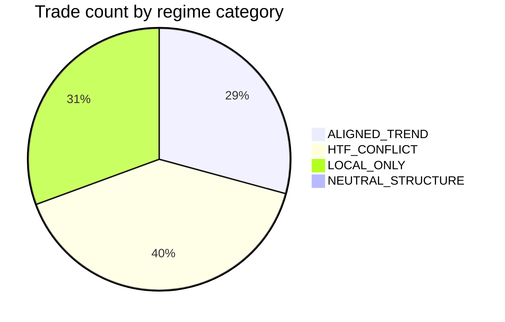

# Trend / Regime Diagnostic (Research Only)

Generated: `2026-10-02T14:56:52.471797+00:00`
Dataset: BOS Combination Research · Combo: `COMBO_02`

> Diagnostic only. Not a profitability claim. Live engines unchanged.

## 1. Current trend-engine definition

```
{'BULLISH': 'last high label HH AND last low label HL AND h2.price>h1.price AND l2.price>l1.price', 'BEARISH': 'last high label LH AND last low label LL AND h2.price<h1.price AND l2.price<l1.price', 'NEUTRAL': 'enough swings but neither bullish nor bearish pattern', 'INSUFFICIENT_DATA': '<2 confirmed highs or <2 confirmed lows', 'local_only': True, 'mtf_in_trend_engine': False, 'uses_close_color': False, 'uses_volume': False, 'uses_adx': False, 'uses_range_width': False, 'atr_in_trend_label': False, 'atr_in_swing_filter_optional': True, 'trend_strength': 'derived from relative HH/HL or LH/LL spacing; floor 0.3 when trending, 0.1 NEUTRAL'}
```

Swing defaults:
- {'15m_5m_1m': {'left': 2, 'right': 2}, '1h_4h_1d': {'left': 3, 'right': 3}, 'atr_period': 14, 'minimum_swing_distance_atr_default': 0.0, 'price_source': 'candle high for swing highs; candle low for swing lows (wicks)', 'confirmation': 'swing at i confirmed only after right bars closed (no look-ahead)'}
- Labels: {'HH': 'swing high price > previous swing high', 'LH': 'swing high price <= previous swing high', 'HL': 'swing low price > previous swing low', 'LL': 'swing low price <= previous swing low'}

## 2. Whether a sideways detector exists

Current engine has trend classification but no independent sideways-regime classification.

Primary category `RANGE_LIKE`: **NOT_AVAILABLE**
No validated production sideways metric; primary category RANGE_LIKE is NOT_AVAILABLE. Separate RANGE_LIKE_CANDIDATE flag uses research-only rule.

## 3. Local vs HTF classification

Setup trend from setup TF swings only. HTF trends from 1h/4h series at last bar with time ≤ entry time. Missing HTF → `HTF_UNAVAILABLE` (never treated as bullish/bearish).

## 4. Regime diagnostic methodology

- `ALIGNED_TREND`: setup trending and available directional HTF(s) agree, none opposite
- `HTF_CONFLICT`: setup trending and ≥1 HTF opposite
- `LOCAL_ONLY`: setup trending; HTF neutral/unavailable/no directional agreement
- `NEUTRAL_STRUCTURE`: setup not BULLISH/BEARISH
- `RANGE_LIKE_CANDIDATE`: separate research flag; see rule in JSON

## 5. Data quality

Trades analyzed: **219**
Overall: `{'sample_size': 219, 'insufficient_sample': False, 'winners': 59, 'losers': 160, 'win_rate': 0.2694063926940639, 'SL_rate': 0.730593607305936, 'TP1_rate': 0.2694063926940639, 'mean_R': -0.14567450115833516, 'median_R': -1.0, 'profit_factor': 0.8006080265395287, 'avg_MAE_R': 1.0888931186614534, 'avg_MFE_R': 1.2063757454200428, 'mean_R_bootstrap_95ci': {'low': -0.32482205787249624, 'high': 0.04019002974175516, 'mean': -0.14567450115833516}}`

## 6. Overall trade breakdown

Regime counts: `{'ALIGNED_TREND': 64, 'HTF_CONFLICT': 88, 'LOCAL_ONLY': 67, 'NEUTRAL_STRUCTURE': 0}`

| Category | n | mean R | win rate | SL rate | insufficient |
|----------|---|--------|----------|---------|--------------|
| ALIGNED_TREND | 64 | 0.251 | 0.406 | 0.594 | False |
| HTF_CONFLICT | 88 | -0.307 | 0.205 | 0.795 | False |
| LOCAL_ONLY | 67 | -0.314 | 0.224 | 0.776 | False |
| NEUTRAL_STRUCTURE | 0 | — | — | — | True |

### Winners vs losers — regime share

Winners: `{'n': 59, 'by_regime': {'ALIGNED_TREND': {'count': 26, 'pct': 44.06779661016949}, 'HTF_CONFLICT': {'count': 18, 'pct': 30.508474576271187}, 'LOCAL_ONLY': {'count': 15, 'pct': 25.423728813559322}, 'NEUTRAL_STRUCTURE': {'count': 0, 'pct': 0.0}}, 'range_like_candidate_count': 0, 'range_like_candidate_pct': 0.0}`
Losers: `{'n': 160, 'by_regime': {'ALIGNED_TREND': {'count': 38, 'pct': 23.75}, 'HTF_CONFLICT': {'count': 70, 'pct': 43.75}, 'LOCAL_ONLY': {'count': 52, 'pct': 32.5}, 'NEUTRAL_STRUCTURE': {'count': 0, 'pct': 0.0}}, 'range_like_candidate_count': 1, 'range_like_candidate_pct': 0.625}`

## 7. 5M analysis

Overall: `{'sample_size': 0, 'insufficient_sample': True}`
By regime: `{'ALIGNED_TREND': {'sample_size': 0, 'insufficient_sample': True}, 'HTF_CONFLICT': {'sample_size': 0, 'insufficient_sample': True}, 'LOCAL_ONLY': {'sample_size': 0, 'insufficient_sample': True}, 'NEUTRAL_STRUCTURE': {'sample_size': 0, 'insufficient_sample': True}}`
By direction: `{'LONG': {'sample_size': 0, 'insufficient_sample': True}, 'SHORT': {'sample_size': 0, 'insufficient_sample': True}}`

## 8. 15M analysis

Overall: `{'sample_size': 109, 'insufficient_sample': False, 'winners': 26, 'losers': 83, 'win_rate': 0.23853211009174313, 'SL_rate': 0.7614678899082569, 'TP1_rate': 0.23853211009174313, 'mean_R': -0.23482748830052114, 'median_R': -1.0, 'profit_factor': 0.6916120936776289, 'avg_MAE_R': 1.1589627849177857, 'avg_MFE_R': 1.1718904816663969, 'mean_R_bootstrap_95ci': {'low': -0.4897414352728157, 'high': 0.034504422885708576, 'mean': -0.23482748830052114}}`
By regime: `{'ALIGNED_TREND': {'sample_size': 34, 'insufficient_sample': False, 'winners': 12, 'losers': 22, 'win_rate': 0.35294117647058826, 'SL_rate': 0.6470588235294118, 'TP1_rate': 0.35294117647058826, 'mean_R': 0.09523587329697192, 'median_R': -1.0, 'profit_factor': 1.1471827132771384, 'avg_MAE_R': 1.0309404500106272, 'avg_MFE_R': 1.3615274206593084, 'mean_R_bootstrap_95ci': {'low': -0.37593125530619753, 'high': 0.5854400596974019, 'mean': 0.09523587329697192}}, 'HTF_CONFLICT': {'sample_size': 53, 'insufficient_sample': False, 'winners': 10, 'losers': 43, 'win_rate': 0.18867924528301888, 'SL_rate': 0.8113207547169812, 'TP1_rate': 0.18867924528301888, 'mean_R': -0.36399624899466554, 'median_R': -1.0, 'profit_factor': 0.5513534605414587, 'avg_MAE_R': 1.1512992642430855, 'avg_MFE_R': 1.0915862539657817, 'mean_R_bootstrap_95ci': {'low': -0.7112592250066403, 'high': 0.0380670564294564, 'mean': -0.36399624899466554}}, 'LOCAL_ONLY': {'sample_size': 22, 'insufficient_sample': True, 'winners': 4, 'losers': 18, 'win_rate': 0.18181818181818182, 'SL_rate': 0.8181818181818182, 'TP1_rate': 0.18181818181818182, 'mean_R': -0.43374612364257153, 'median_R': -1.0, 'profit_factor': 0.46986584888130145, 'avg_MAE_R': 1.3752776023088085, 'avg_MFE_R': 1.072275397228834, 'mean_R_bootstrap_95ci': {'low': -0.8636363636363636, 'high': 0.1297895592130104, 'mean': -0.43374612364257153}}, 'NEUTRAL_STRUCTURE': {'sample_size': 0, 'insufficient_sample': True}}`
By direction: `{'LONG': {'sample_size': 58, 'insufficient_sample': False, 'winners': 18, 'losers': 40, 'win_rate': 0.3103448275862069, 'SL_rate': 0.6896551724137931, 'TP1_rate': 0.3103448275862069, 'mean_R': -0.03574617637766215, 'median_R': -1.0, 'profit_factor': 0.9481680442523899, 'avg_MAE_R': 1.1163953115999123, 'avg_MFE_R': 1.2401518226498691, 'mean_R_bootstrap_95ci': {'low': -0.3968146268865973, 'high': 0.33872535165190437, 'mean': -0.03574617637766215}}, 'SHORT': {'sample_size': 51, 'insufficient_sample': False, 'winners': 8, 'losers': 43, 'win_rate': 0.1568627450980392, 'SL_rate': 0.8431372549019608, 'TP1_rate': 0.1568627450980392, 'mean_R': -0.46123368617357646, 'median_R': -1.0, 'profit_factor': 0.45295539546854885, 'avg_MAE_R': 1.2073728526126224, 'avg_MFE_R': 1.0942599370185264, 'mean_R_bootstrap_95ci': {'low': -0.763096803319803, 'high': -0.04263334339916654, 'mean': -0.46123368617357646}}}`

## 9. 1H analysis

Overall: `{'sample_size': 110, 'insufficient_sample': False, 'winners': 33, 'losers': 77, 'win_rate': 0.3, 'SL_rate': 0.7, 'TP1_rate': 0.3, 'mean_R': -0.0573319957174418, 'median_R': -1.0, 'profit_factor': 0.9180971489750831, 'avg_MAE_R': 1.019460449371088, 'avg_MFE_R': 1.2405475067759284, 'mean_R_bootstrap_95ci': {'low': -0.3257213266048934, 'high': 0.24214865282423514, 'mean': -0.0573319957174418}}`
By regime: `{'ALIGNED_TREND': {'sample_size': 30, 'insufficient_sample': False, 'winners': 14, 'losers': 16, 'win_rate': 0.4666666666666667, 'SL_rate': 0.5333333333333333, 'TP1_rate': 0.4666666666666667, 'mean_R': 0.42851346837631943, 'median_R': -1.0, 'profit_factor': 1.803462753205599, 'avg_MAE_R': 0.880231538836632, 'avg_MFE_R': 1.628891789870473, 'mean_R_bootstrap_95ci': {'low': -0.17864691879102856, 'high': 0.9491116441620734, 'mean': 0.42851346837631943}}, 'HTF_CONFLICT': {'sample_size': 35, 'insufficient_sample': False, 'winners': 8, 'losers': 27, 'win_rate': 0.22857142857142856, 'SL_rate': 0.7714285714285715, 'TP1_rate': 0.22857142857142856, 'mean_R': -0.21988871425419332, 'median_R': -1.0, 'profit_factor': 0.7149590741149346, 'avg_MAE_R': 1.0899679301459344, 'avg_MFE_R': 1.1248405649762134, 'mean_R_bootstrap_95ci': {'low': -0.7017569252408354, 'high': 0.2621482654362016, 'mean': -0.21988871425419332}}, 'LOCAL_ONLY': {'sample_size': 45, 'insufficient_sample': False, 'winners': 11, 'losers': 34, 'win_rate': 0.24444444444444444, 'SL_rate': 0.7555555555555555, 'TP1_rate': 0.24444444444444444, 'mean_R': -0.254795968473587, 'median_R': -1.0, 'profit_factor': 0.6627700417261349, 'avg_MAE_R': 1.0574405713469557, 'avg_MFE_R': 1.071645606112677, 'mean_R_bootstrap_95ci': {'low': -0.5939457825056788, 'high': 0.14469282806695444, 'mean': -0.254795968473587}}, 'NEUTRAL_STRUCTURE': {'sample_size': 0, 'insufficient_sample': True}}`
By direction: `{'LONG': {'sample_size': 49, 'insufficient_sample': False, 'winners': 19, 'losers': 30, 'win_rate': 0.3877551020408163, 'SL_rate': 0.6122448979591837, 'TP1_rate': 0.3877551020408163, 'mean_R': 0.24511377051320324, 'median_R': -1.0, 'profit_factor': 1.400352491838232, 'avg_MAE_R': 0.9414278182973325, 'avg_MFE_R': 1.4882465886320613, 'mean_R_bootstrap_95ci': {'low': -0.20423640961281567, 'high': 0.7017322631072319, 'mean': 0.24511377051320324}}, 'SHORT': {'sample_size': 61, 'insufficient_sample': False, 'winners': 14, 'losers': 47, 'win_rate': 0.22950819672131148, 'SL_rate': 0.7704918032786885, 'TP1_rate': 0.22950819672131148, 'mean_R': -0.30028023416500915, 'median_R': -1.0, 'profit_factor': 0.6102745897007328, 'avg_MAE_R': 1.0821423989221375, 'avg_MFE_R': 1.0415761131537886, 'mean_R_bootstrap_95ci': {'low': -0.6019832967584733, 'high': 0.0057426670072382845, 'mean': -0.30028023416500915}}}`

## 10. LONG analysis

`{'overall': {'sample_size': 107, 'insufficient_sample': False, 'winners': 37, 'losers': 70, 'win_rate': 0.34579439252336447, 'SL_rate': 0.6542056074766355, 'TP1_rate': 0.34579439252336447, 'mean_R': 0.09287193014245379, 'median_R': -1.0, 'profit_factor': 1.1419613789320366, 'avg_MAE_R': 1.0362700109286374, 'avg_MFE_R': 1.3537653136136767, 'mean_R_bootstrap_95ci': {'low': -0.18236691623488674, 'high': 0.38525292267403516, 'mean': 0.09287193014245379}}, 'by_regime': {'ALIGNED_TREND': {'sample_size': 40, 'insufficient_sample': False, 'winners': 22, 'losers': 18, 'win_rate': 0.55, 'SL_rate': 0.45, 'TP1_rate': 0.55, 'mean_R': 0.7018152463010012, 'median_R': 2.0, 'profit_factor': 2.5595894362244476, 'avg_MAE_R': 0.794802218488477, 'avg_MFE_R': 1.7626505727924684, 'mean_R_bootstrap_95ci': {'low': 0.22019195117822452, 'high': 1.1926943821160776, 'mean': 0.7018152463010012}}, 'HTF_CONFLICT': {'sample_size': 36, 'insufficient_sample': False, 'winners': 9, 'losers': 27, 'win_rate': 0.25, 'SL_rate': 0.75, 'TP1_rate': 0.25, 'mean_R': -0.1636260334241767, 'median_R': -1.0, 'profit_factor': 0.7818319554344312, 'avg_MAE_R': 1.1172466612343257, 'avg_MFE_R': 1.135877233736477, 'mean_R_bootstrap_95ci': {'low': -0.6446901508039057, 'high': 0.32221948260046435, 'mean': -0.1636260334241767}}, 'LOCAL_ONLY': {'sample_size': 31, 'insufficient_sample': False, 'winners': 6, 'losers': 25, 'win_rate': 0.1935483870967742, 'SL_rate': 0.8064516129032258, 'TP1_rate': 0.1935483870967742, 'mean_R': -0.3949927781782947, 'median_R': -1.0, 'profit_factor': 0.5102089550589146, 'avg_MAE_R': 1.2538039556577227, 'avg_MFE_R': 1.079202749369403, 'mean_R_bootstrap_95ci': {'low': -0.805515020706859, 'high': 0.03263715688907113, 'mean': -0.3949927781782947}}, 'NEUTRAL_STRUCTURE': {'sample_size': 0, 'insufficient_sample': True}}, 'by_tf': {'5m': {'sample_size': 0, 'insufficient_sample': True}, '15m': {'sample_size': 58, 'insufficient_sample': False, 'winners': 18, 'losers': 40, 'win_rate': 0.3103448275862069, 'SL_rate': 0.6896551724137931, 'TP1_rate': 0.3103448275862069, 'mean_R': -0.03574617637766215, 'median_R': -1.0, 'profit_factor': 0.9481680442523899, 'avg_MAE_R': 1.1163953115999123, 'avg_MFE_R': 1.2401518226498691, 'mean_R_bootstrap_95ci': {'low': -0.3968146268865973, 'high': 0.33872535165190437, 'mean': -0.03574617637766215}}, '1h': {'sample_size': 49, 'insufficient_sample': False, 'winners': 19, 'losers': 30, 'win_rate': 0.3877551020408163, 'SL_rate': 0.6122448979591837, 'TP1_rate': 0.3877551020408163, 'mean_R': 0.24511377051320324, 'median_R': -1.0, 'profit_factor': 1.400352491838232, 'avg_MAE_R': 0.9414278182973325, 'avg_MFE_R': 1.4882465886320613, 'mean_R_bootstrap_95ci': {'low': -0.20423640961281567, 'high': 0.7017322631072319, 'mean': 0.24511377051320324}}}}`

## 11. SHORT analysis

`{'overall': {'sample_size': 112, 'insufficient_sample': False, 'winners': 22, 'losers': 90, 'win_rate': 0.19642857142857142, 'SL_rate': 0.8035714285714286, 'TP1_rate': 0.19642857142857142, 'mean_R': -0.3735715382046246, 'median_R': -1.0, 'profit_factor': 0.5351109746786894, 'avg_MAE_R': 1.1391669805133404, 'avg_MFE_R': 1.0655660686636248, 'mean_R_bootstrap_95ci': {'low': -0.6181039032644223, 'high': -0.1293320553469545, 'mean': -0.3735715382046246}}, 'by_regime': {'ALIGNED_TREND': {'sample_size': 24, 'insufficient_sample': True, 'winners': 4, 'losers': 20, 'win_rate': 0.16666666666666666, 'SL_rate': 0.8333333333333334, 'TP1_rate': 0.16666666666666666, 'mean_R': -0.49913275452722594, 'median_R': -1.0, 'profit_factor': 0.4010406945673289, 'avg_MAE_R': 1.236118030246717, 'avg_MFE_R': 1.0271942952846642, 'mean_R_bootstrap_95ci': {'low': -0.875, 'high': 0.0, 'mean': -0.49913275452722594}}, 'HTF_CONFLICT': {'sample_size': 52, 'insufficient_sample': False, 'winners': 9, 'losers': 43, 'win_rate': 0.17307692307692307, 'SL_rate': 0.8269230769230769, 'TP1_rate': 0.17307692307692307, 'mean_R': -0.40571863446814765, 'median_R': -1.0, 'profit_factor': 0.509363511805961, 'avg_MAE_R': 1.1335934376068368, 'avg_MFE_R': 1.083305977304629, 'mean_R_bootstrap_95ci': {'low': -0.7532665664140276, 'high': 0.008323685099712144, 'mean': -0.40571863446814765}}, 'LOCAL_ONLY': {'sample_size': 36, 'insufficient_sample': False, 'winners': 9, 'losers': 27, 'win_rate': 0.25, 'SL_rate': 0.75, 'TP1_rate': 0.25, 'mean_R': -0.243429366053357, 'median_R': -1.0, 'profit_factor': 0.6754275119288573, 'avg_MAE_R': 1.0825836204449275, 'avg_MFE_R': 1.0655229384348144, 'mean_R_bootstrap_95ci': {'low': -0.6633796145796397, 'high': 0.17797313258836678, 'mean': -0.243429366053357}}, 'NEUTRAL_STRUCTURE': {'sample_size': 0, 'insufficient_sample': True}}, 'by_tf': {'5m': {'sample_size': 0, 'insufficient_sample': True}, '15m': {'sample_size': 51, 'insufficient_sample': False, 'winners': 8, 'losers': 43, 'win_rate': 0.1568627450980392, 'SL_rate': 0.8431372549019608, 'TP1_rate': 0.1568627450980392, 'mean_R': -0.46123368617357646, 'median_R': -1.0, 'profit_factor': 0.45295539546854885, 'avg_MAE_R': 1.2073728526126224, 'avg_MFE_R': 1.0942599370185264, 'mean_R_bootstrap_95ci': {'low': -0.763096803319803, 'high': -0.04263334339916654, 'mean': -0.46123368617357646}}, '1h': {'sample_size': 61, 'insufficient_sample': False, 'winners': 14, 'losers': 47, 'win_rate': 0.22950819672131148, 'SL_rate': 0.7704918032786885, 'TP1_rate': 0.22950819672131148, 'mean_R': -0.30028023416500915, 'median_R': -1.0, 'profit_factor': 0.6102745897007328, 'avg_MAE_R': 1.0821423989221375, 'avg_MFE_R': 1.0415761131537886, 'mean_R_bootstrap_95ci': {'low': -0.6019832967584733, 'high': 0.0057426670072382845, 'mean': -0.30028023416500915}}}}`

## 12. HTF conflict analysis

`{'setup_BEARISH__htf_BEARISH': {'sample_size': 23, 'insufficient_sample': True, 'winners': 3, 'losers': 20, 'win_rate': 0.13043478260869565, 'SL_rate': 0.8695652173913043, 'TP1_rate': 0.13043478260869565, 'mean_R': -0.6086956521739131, 'median_R': -1.0, 'profit_factor': 0.3, 'avg_MAE_R': 1.1470203919804192, 'avg_MFE_R': 1.0467487068912147, 'mean_R_bootstrap_95ci': {'low': -1.0, 'high': -0.08695652173913043, 'mean': -0.6086956521739131}}, 'setup_BEARISH__htf_BULLISH': {'sample_size': 44, 'insufficient_sample': False, 'winners': 9, 'losers': 35, 'win_rate': 0.20454545454545456, 'SL_rate': 0.7954545454545454, 'TP1_rate': 0.20454545454545456, 'mean_R': -0.29766747709872, 'median_R': -1.0, 'profit_factor': 0.6257894573616092, 'avg_MAE_R': 1.1213338497834444, 'avg_MFE_R': 1.1278602484173503, 'mean_R_bootstrap_95ci': {'low': -0.7143975827624647, 'high': 0.13079499865201274, 'mean': -0.29766747709872}}, 'setup_BEARISH__htf_NEUTRAL': {'sample_size': 45, 'insufficient_sample': False, 'winners': 10, 'losers': 35, 'win_rate': 0.2222222222222222, 'SL_rate': 0.7777777777777778, 'TP1_rate': 0.2222222222222222, 'mean_R': -0.3276142952572061, 'median_R': -1.0, 'profit_factor': 0.5787816203835922, 'avg_MAE_R': 1.1525898535882868, 'avg_MFE_R': 1.0142739666992135, 'mean_R_bootstrap_95ci': {'low': -0.6642613836012717, 'high': 0.0721362611443322, 'mean': -0.3276142952572061}}, 'setup_BULLISH__htf_BEARISH': {'sample_size': 25, 'insufficient_sample': True, 'winners': 6, 'losers': 19, 'win_rate': 0.24, 'SL_rate': 0.76, 'TP1_rate': 0.24, 'mean_R': -0.16779080768778884, 'median_R': -1.0, 'profit_factor': 0.7792226214634358, 'avg_MAE_R': 1.0891873719116492, 'avg_MFE_R': 1.14259656806844, 'mean_R_bootstrap_95ci': {'low': -0.755627296808485, 'high': 0.5029170984463568, 'mean': -0.16779080768778884}}, 'setup_BULLISH__htf_BULLISH': {'sample_size': 39, 'insufficient_sample': False, 'winners': 21, 'losers': 18, 'win_rate': 0.5384615384615384, 'SL_rate': 0.46153846153846156, 'TP1_rate': 0.5384615384615384, 'mean_R': 0.6697155226058376, 'median_R': 2.0, 'profit_factor': 2.4510502989793146, 'avg_MAE_R': 0.7960640309213117, 'avg_MFE_R': 1.6958930345954348, 'mean_R_bootstrap_95ci': {'low': 0.1774252091448892, 'high': 1.1795743242272614, 'mean': 0.6697155226058376}}, 'setup_BULLISH__htf_NEUTRAL': {'sample_size': 43, 'insufficient_sample': False, 'winners': 10, 'losers': 33, 'win_rate': 0.23255813953488372, 'SL_rate': 0.7674418604651163, 'TP1_rate': 0.23255813953488372, 'mean_R': -0.2787636898648927, 'median_R': -1.0, 'profit_factor': 0.6367624647215034, 'avg_MAE_R': 1.2233653410614378, 'avg_MFE_R': 1.1662359536216382, 'mean_R_bootstrap_95ci': {'low': -0.6468420479686415, 'high': 0.08860202534394936, 'mean': -0.2787636898648927}}}`

## 13. BOS quality analysis

`{'avg_bos_atr_distance_winners': 0.9322703292880127, 'avg_bos_atr_distance_losers': 0.8051108667187913, 'avg_bos_body_ratio_winners': None, 'avg_bos_body_ratio_losers': None, 'avg_bars_since_bos_winners': None, 'avg_bars_since_bos_losers': None}`

## 14. Range/chop diagnostic

`{'rule': 'RANGE_LIKE_CANDIDATE if trend_strength<0.55 AND direction_changes>=4 AND recent_range_ATR<=3.5 (window=40 bars, pre-entry only)', 'count': 1, 'stats': {'sample_size': 1, 'insufficient_sample': True, 'winners': 0, 'losers': 1, 'win_rate': 0.0, 'SL_rate': 1.0, 'TP1_rate': 0.0, 'mean_R': -1.0, 'median_R': -1.0, 'profit_factor': 0.0, 'avg_MAE_R': 1.3184584297962236, 'avg_MFE_R': 0.26828734887988787, 'mean_R_bootstrap_95ci': None}, 'among_losers_pct': 0.625, 'among_winners_pct': 0.0}`

## 15. Historical-depth analysis

`{'<300': {'sample_size': 0, 'insufficient_sample': True}, '300-999': {'sample_size': 0, 'insufficient_sample': True}, '1000-4999': {'sample_size': 219, 'insufficient_sample': False, 'winners': 59, 'losers': 160, 'win_rate': 0.2694063926940639, 'SL_rate': 0.730593607305936, 'TP1_rate': 0.2694063926940639, 'mean_R': -0.14567450115833516, 'median_R': -1.0, 'profit_factor': 0.8006080265395287, 'avg_MAE_R': 1.0888931186614534, 'avg_MFE_R': 1.2063757454200428, 'mean_R_bootstrap_95ci': {'low': -0.32482205787249624, 'high': 0.04019002974175516, 'mean': -0.14567450115833516}}, '5000+': {'sample_size': 0, 'insufficient_sample': True}}`

## 16. Sample-size warnings

Any group with `sample_size < 30` is flagged `insufficient_sample` / INSUFFICIENT_SAMPLE — do not over-interpret.

## 17. Limitations

- COMBO_02 Path A only (Trend+BOS); not full live Path B
- 4h history in DB may be short → many HTF_UNAVAILABLE on 4h
- RANGE_LIKE primary category NOT_AVAILABLE; candidate rule is research-only
- No ADX/sideways production detector
- Uneven history depth across series
- Fees not re-simulated in this diagnostic (R from engine)

## Research observations

- Analyzed n=219 closed COMBO_02 trades.
- 23.750% of losing trades (38/160) occurred in ALIGNED_TREND.
- 43.750% of losing trades (70/160) occurred in HTF_CONFLICT.
- 32.500% of losing trades (52/160) occurred in LOCAL_ONLY.
- 0.000% of losing trades (0/160) occurred in NEUTRAL_STRUCTURE.
- 0.625% of losing trades were RANGE_LIKE_CANDIDATE (1).
- 64 trades were classified ALIGNED_TREND.
- 88 trades were classified HTF_CONFLICT.
- 67 trades were classified LOCAL_ONLY.
- 0 trades were classified NEUTRAL_STRUCTURE.
- RANGE_LIKE_CANDIDATE had n=1 (insufficient_sample=True).
- History bucket <300: n=0 mean_R=— insufficient=True.
- History bucket 300-999: n=0 mean_R=— insufficient=True.
- History bucket 1000-4999: n=219 mean_R=-0.146 insufficient=False.
- History bucket 5000+: n=0 mean_R=— insufficient=True.

## Charts (diagnostic)


